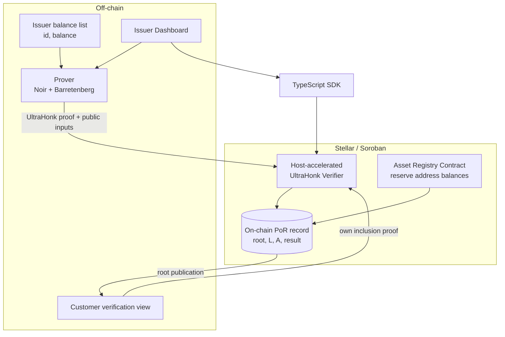
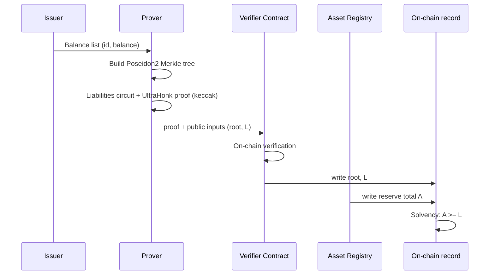

# ZK Proof of Reserves on Stellar: Architecture

A Noir and UltraHonk system on Stellar (Soroban). It lets an issuer prove that
its reserves cover the customer liabilities, without disclosure of the individual
customer balances.

**Stack:** Noir (circuit language), UltraHonk (proving, universal setup, no
ceremony for each circuit), Barretenberg (`bb`, prover), a host-accelerated
Soroban UltraHonk verifier built on the CAP-0080 BN254 host functions, Poseidon2
(BN254 Fr), a TypeScript SDK, and an issuer dashboard.

> Status: a feasibility test on 2026-06-26 verified the technical feasibility on
> a Protocol 26 localnet. The numbers in section 3 are measurements from that
> localnet, not estimates. The project then validated the sound recursive PoR
> path end to end on the real Stellar testnet at Protocol 27. The verifier wasm,
> the circuits, and the VK are byte-identical to the P26 measurement. Only the
> network-facing pins moved. The architecture below states the results of the
> feasibility test, in particular the choice of the host-accelerated verifier
> path.

---

## 1. Problem and goal

The largest and fastest-growing segment on Stellar is RWA and stablecoins.
Issuers in this segment face a tension. Regulation and trust demand reserve
transparency. Disclosure of the customer balance distribution exposes
commercially sensitive information. A traditional Merkle-tree Proof of Reserves
leaks balance information, because it carries the sums in the intermediate nodes.

Goal: the issuer proves the claim "my reserves cover my liabilities"
cryptographically, the individual data stays private, and every customer can
independently verify that the committed total includes their own balance.

---

## 2. Scope

### In scope (MVP)
- The Proof of Liabilities ZK core: Poseidon2 Merkle tree, sum conservation,
  non-negativity, inclusion.
- On-chain Proof of Assets: the balance sum, and the ownership of the reserve
  addresses on Stellar by the issuer.
- Solvency check: do the assets cover the liabilities.
- Off-chain prover (proof generation) and issuer dashboard.
- Customer-side inclusion verification view.
- TypeScript SDK (generate and verify wrappers).

### Out of scope (deliberate boundary)
- The real existence of the off-chain reserves (bank deposits, tokenized
  treasuries). This is not cryptographically verifiable and needs an auditor
  attestation or an oracle attestation. The MVP leaves only an attestation
  interface.
- The scale-up to millions of users. Recursive aggregation is implemented, and
  it folds the batch proofs into one on-chain verify. The orchestration for a
  customer base of that size is not in this scope.
- Cross-chain reserve proofs and the fiat off-ramp.

---

## 3. Verified feasibility

All the figures in this section are measurements on a Protocol 26 localnet with
the real toolchain. They are not assumptions. They are the feasibility numbers
for a single monolithic host-accelerated verify. They establish the design
choice: the host-accelerated path, a verify cost that is flat in circuit
complexity, and headroom well under the 400M limit. They are not the production
cost. Production uses the recursion path. The terminal verify of that path is a
different and larger artifact (20,536-byte wasm, about 114.77M instructions).
Sections 10 and 12 hold those numbers. That production verifier is the artifact
that is byte-identical across the move from Protocol 26 to Protocol 27, and that
the project validated on the real Protocol 27 testnet. The monolithic verifier
measured here is not that artifact. See SECURITY.md.

- **The choice of verifier is decisive.** The pure-Wasm verifier (the indextree
  reference) spends **415,151,219 instructions** to verify a single proof and
  **exceeds the network limit of 400M for each transaction**, so it only runs on
  an `--limits unlimited` localnet. The **host-accelerated verifier**
  (`NethermindEth/rs-soroban-ultrahonk`, CAP-0080 BN254 host functions; the
  feasibility test measured upstream HEAD, and the repository now vendors the
  crate at the pinned rev 661db07) does the same work in **~80M instructions**,
  about 20% of the limit. The base of this project is therefore the
  host-accelerated path, and not the pure-Wasm one.
- **The verification cost is constant for any circuit complexity.** A circuit
  with 100 range asserts, a circuit with 18 public inputs, and a depth-20 Merkle
  circuit all verify at about the same ~80M instructions. This property defines
  the design for PoR: a complex liabilities circuit still verifies on-chain at
  ~80M. Complexity affects the prover and the proof generation. It does not
  affect the on-chain verification.
- **Cost and size, host-accelerated path:** ~80M instructions, ~0.09 XLM (about
  899k stroops) for each verification. The proof size is a fixed **14,592
  bytes**. The VK size is a fixed **1,760 bytes**. The optimized verifier
  contract wasm is **19,655 bytes** for this monolithic verifier. The production
  recursion verifier wasm is 20,536 bytes (see sections 10 and 12).
- **Network limits (read live; testnet and mainnet are identical):**
  `txMaxInstructions` = 400,000,000, `ledgerMaxInstructions` = 580,000,000,
  `txMemoryLimit` = 40 MiB.
- **Throughput ceiling:** 580M for each ledger, divided by ~80M for each
  verification, gives about **7 verifications for each ledger**. The architecture
  must respect this limit (see section 9).
- **Protocol:** CAP-0080 shipped in Protocol 26, and the feasibility test
  confirmed that Protocol 26 was live. The network is now Protocol 27. The
  project re-validated the path there with the BN254 host functions intact and
  the verifier byte-identical. Confirm again that CAP-0080 is active on mainnet
  at launch time.

---

## 4. System architecture

Components:

1. **Noir circuits.** They hold the cryptographic logic. The original design had
   two circuits, liabilities and inclusion. The implemented path is the recursive
   inner batch circuit plus the aggregator (`circuits/recursion`). See sections 6
   and 10.
2. **Off-chain prover.** It builds the Poseidon2 Merkle tree from the balance
   list, runs the Noir circuit, and produces an UltraHonk proof and a
   verification key with `bb`.
3. **Host-accelerated Soroban UltraHonk verifier.** It verifies the proof
   on-chain with the CAP-0080 BN254 host functions (MSM, pairing, Fr arithmetic).
   It is adapted from the `NethermindEth/rs-soroban-ultrahonk` host-accelerated
   verifier, which yugocabrio wrote. The deploy step sets the VK.
4. **Asset Registry contract.** It reads the balances of the reserve addresses of
   the issuer on Stellar and computes the total assets (A).
5. **Issuer dashboard and customer view.** The issuer uploads the balances,
   generates a proof, submits it, and sees the status. The customer verifies
   their own inclusion.
6. **TypeScript SDK.** A library that wraps the proof generation flow and the
   verification flow, for other teams to integrate.

---

## 5. Proving stack and rationale

The project chose Noir and UltraHonk over Groth16 because of the trusted setup
category.

| Category | Example | Ceremony | Status on Stellar |
|---|---|---|---|
| Circuit-specific setup | Groth16 | Separate per circuit | Mature but a ceremony burden per circuit |
| Universal / updatable setup | PLONK, UltraHonk | One, reusable | Practical, cheap, proven tooling |
| Fully transparent | STARK, post-quantum | None | Blocked on memory in Soroban, about 16x more expensive |

UltraHonk uses a universal setup. You do not run your own ceremony for each
circuit. You use the existing universal KZG SRS. The operational pain of Groth16
disappears in this category. The fully transparent path is mathematically the
cleanest one, but it is impractical on Stellar today. It consumes too much memory
in the Soroban environment, and each update costs an order of magnitude more than
in the universal setup path. The project therefore does not choose it for this
project window.

The choice of verifier within this path, from the feasibility test:

| Verifier | Circuit | Instructions | Min fee | Against 400M tx limit |
|---|---|---|---|---|
| Pure-Wasm (indextree reference) | tornado (2 pub) | 415,151,219 | ~4.25M stroops | Exceeds limit (~104%) |
| **Host-accelerated (CAP-0080)** | tornado (2 pub) | **79,899,205** | ~899k stroops | OK (~20%) |
| Host-accelerated | range_heavy (100 range asserts) | 79,751,362 | ~898k | OK |
| Host-accelerated | many_pubs (18 pub) | 79,485,839 | ~898k | OK |

The base is the host-accelerated verifier. The project keeps the indextree
pure-Wasm verifier only as a reference and a learning aid, because it cannot
verify in a single transaction on the real network.

**Proof generation command (it determines the format and must stay fixed):**
`bb prove --scheme ultra_honk --oracle_hash keccak --output_format bytes_and_fields`
The on-chain transcript needs `oracle_hash keccak`. The prover must produce the
VK and the proof with this choice, and the build of the verifier must use the
same assumption.

---

## 6. Circuit design

**Production status.** The implemented path is the recursive inner batch circuit
plus the aggregator (`circuits/recursion`). It completes the deferred recursive
pairing on-chain, and the project validated it end to end on the real Protocol 27
testnet (see sections 10 and 12, and SECURITY.md). The inner batch circuit
realizes the per-batch logic of section 6.1 below: the Poseidon2 leaf, the u64
range check, the u128 sum, and the Merkle membership check. The inclusion circuit
of section 6.2 is roadmap work and does not exist yet. The subsections below
describe the circuit design. They do not claim that the single liabilities
circuit is the current implementation.

### 6.1 Liabilities circuit

It commits the total liability of the issuer without disclosure of the individual
balances.

- **Private input:** the list of customer leaves, each one an `(id, balance)`
  pair.
- **Public input:** the Merkle root, and the total liability `L`.
- **Constraints:**
  1. The circuit hashes each leaf correctly as `leaf = Poseidon2(id, balance)`.
  2. The Merkle tree that the circuit builds from the leaves agrees with the
     given `root`.
  3. The sum of all the balances equals the committed `L`: `sum(balance) == L`.
  4. Each balance is in range. This check is critical. Without a range check the
     issuer can inject a negative balance to lower the total falsely.

**Typed integer rule (from the feasibility test, security-critical).** The
balances must be typed integers: `u64` for the value, and a `u128` accumulator
for the sum. A bare `Field` is not acceptable. A bare `Field` wraps mod p and is
not non-negative, so a negative balance or a wrapped balance passes silently. The
sum accumulator must be `u128`, to avoid an overflow when the circuit adds many
`u64` values.

### 6.2 Inclusion circuit

It lets a customer verify that the committed tree contains their own balance,
without a view of the data of any other customer.

- **Private input:** the `(id, balance)` pair of the customer, and the Merkle
  path.
- **Public input:** the Merkle root.
- **Constraint:** the leaf belongs to the given root.

The Merkle membership pattern from the reference is mature, and both circuits
reuse it directly. That pattern is a depth-folded Poseidon2 with a bit-constrained
path. The only item to fix is the leaf formula and the hash arity for the PoR
semantics: the commitment includes the balance and a salt.

### 6.3 Assets (on-chain, not ZK)

The Asset Registry contract reads the on-chain balances of the declared reserve
addresses of the issuer and computes the total `A`. The issuer proves the
ownership of those addresses by signature. This part needs no ZK. If the project
wants address privacy, a second phase can extend this part with ZK.

### 6.4 Solvency

A check that `A >= L`. If both values are public, an on-chain comparison is
enough. If the project wants privacy, it needs a range proof.

---

## 7. Data flow

This section shows the original single-proof flow. The production path proves the
customers in batches and folds them into one terminal proof with recursive
aggregation (see sections 6 and 10).

### Issuer flow

### Customer flow

1. The customer gets their own `(id, balance)` pair and Merkle path from the
   issuer.
2. The customer verifies the inclusion against the published root locally, or
   generates an inclusion proof.
3. The customer independently confirms that the committed total counts their
   balance.

---

## 8. Trust and security model

**Setup assumption.** The universal KZG SRS. There is no ceremony for each
circuit, and the project uses the existing universal ceremony. The trust
assumption is 1-of-N honest: the security holds if at least one of the many
contributors is honest. The project treats this as practically risk-free.

**What the system guarantees:**
- The committed total liability equals the sum of the real balances.
- No balance is negative.
- Every customer can verify their own inclusion.

**What the system does not guarantee:**
- The real existence of the off-chain reserves. This needs an attestation and is
  out of scope.
- That the issuer included all the customers (the completeness problem, or the
  omission problem). This is the classic weakness of PoR. The check that each
  customer makes on their own inclusion mitigates it in part: if enough customers
  check, an omission becomes visible.

---

## 9. Throughput and design constraints

The feasibility test measured a ceiling of about 7 verifications for each ledger,
for the monolithic host-accelerated verify. The production path submits one
attestation transaction. On the real Protocol 27 testnet, that transaction with
one reserve address declared 122,268,806 instructions and consumed 117,524,415
instructions. The network enforces its caps against the declaration. The live
settings of the testnet and of the mainnet, read on 2026-08-09, both set
400,000,000 instructions for each transaction and 580,000,000 instructions
for each ledger. One ledger budget
therefore holds 4 such declarations. The reserve count moves the cost very
little. Simulations against the live registry measured one added balance read.
The read costs about 0.10M declared instructions for a classic asset. It costs
about 0.36M for a contract token with 101,195 bytes of code, near the size
limit of 131,072 bytes. At the limit of 32
reserve addresses the declaration rises to about 125M for a classic asset, and
to about 137M for such a contract token. The token figure carries the parse of
the token code once, and the marginal cost of the read for each address after
that. Proof of Reserves submits one
attestation for each epoch, so this is headroom and not a binding limit. It
still forces a specific design:

- One root and one batch attestation for each reporting period. Not one
  verification for each customer.
- The customer inclusion checks run on demand and on the client, against the
  published root. There is no on-chain transaction for each customer.
- For a large liabilities circuit the bottleneck is the proof generation, not the
  verification, because the verification cost does not grow with the circuit
  size. The production attestation transaction consumed about 117.52M
  instructions on the Protocol 27 testnet, whatever the size of the
  liabilities circuit. The
  prover-side
  architecture was the real design question: either recursive aggregation, or a
  split design of per-user inclusion plus a separate proof of the aggregate sum.
  The chosen and implemented path is recursive aggregation. The inner batch
  circuit folds into the hardened aggregator, and the project validated this end
  to end on the real Protocol 27 testnet (see sections 10 and 12).

---

## 10. Out of scope / future work

- Off-chain reserve attestation (auditor or oracle). The MVP has the interface
  only.
- Cross-chain reserve proofs and the fiat off-ramp.
- ZK address privacy on the asset side.

### Deferred (the recursive-aggregation path is now in production; these items remain before project close)

- **Batched-into-Shplemini pairing completion.** The production verifier
  completes the deferred recursive pairing as a NAIVE separate `pairing_check`.
  The measurement is 114.77M instructions, about 28.7% of the cap of 400M for
  each transaction. The completion adds ~15.6M instructions, independent of the
  fold count K. The optimization folds this completion into the existing
  Shplemini pairing of the verifier, through the transcript separator challenge,
  with no extra Miller loop. It lowers the cost of the terminal verify and
  protects the instruction-limit headroom as the recursive depth grows. It is
  scheduled AFTER the audit of the production verifier and after that verifier is
  stable, and BEFORE project close. When it is done, it MUST pass the same
  soundness gate: honest ACCEPT, forged REJECT, deflated REJECT.

---

## 11. Risks

- **Unaudited verifier (the highest risk).** No party audited the
  host-accelerated verifier. A verifier bug means that the verifier silently
  accepts a forged proof, which makes the funds look backed when they are not.
  The production verifier now completes the deferred recursive pairing on-chain.
  An independent audit must cover BOTH the naive form that ships now AND the
  batched form that comes later. The audit must cover
  `complete_pairing_point_accumulator`, the decode from the 68-bit limbs to G1
  (`point_from` and `coord_be`), and the `pairing_check` convention, against the
  bb 0.87.0 proof format. The soundness gate (honest ACCEPT, forged REJECT,
  deflated REJECT) is necessary, but it is NOT a substitute for an audit. The
  launch needs an audit and a positive test and a negative test for each circuit.
- **Version fragility.** The proof format depends on `bb 0.87.0`, on
  `oracle_hash keccak`, and on Noir `1.0.0-beta.9`. If any one of these changes,
  the VK, the proof, and the verifier must change together, and the project must
  test the compatibility again. All of them are pinned and locked.
- **Protocol-version drift.** The verifier depends on the CAP-0080 BN254 host
  functions and on a stable proof format. Testnet is now Protocol 27, and the
  project re-validated the path there with the verifier byte-identical. The bump
  from P26 to P27 therefore did not break the proof format or the host functions.
  A future bump can still break them. The soundness gate guards against this: it
  runs the honest case, the forged case, and the deflated case against the
  production artifacts on a P27 localnet, so a protocol change that breaks
  soundness fails the gate. Confirm that CAP-0080 stays active and that the proof
  format stays stable on mainnet at launch.
- **Typed integer and overflow discipline.** The balances are typed integers, not
  `Field` values. The sum accumulator is `u128`. A missing range constraint is a
  hidden vulnerability.
- **Throughput.** About 7 verifications for each ledger for the monolithic
  verify, and 4 attestation transactions for each ledger for the production
  path. The attestation declares 122.27M instructions, and the ledger budget of
  580M on the Protocol 27 testnet holds 4 such declarations. Proof of
  Reserves submits one root and one batch attestation for each period, so this is
  headroom. Do not scale the on-chain verification for each customer.
- **Prover cost.** In a large liabilities circuit the bottleneck is the proof
  generation, not the verification. Evaluate recursive aggregation, or an
  architecture of per-user inclusion plus a separate proof of the sum.

---

## 12. Pinned version matrix

The feasibility test verified that these versions work. Pin and lock all of them.

| Component | Working version | Note |
|---|---|---|
| Nargo (Noir) | 1.0.0-beta.9 | |
| Barretenberg (`bb`) | 0.87.0 | linux amd64 binary |
| Noir Poseidon library | noir-lang/poseidon v0.2.0 | `Poseidon2` |
| In-circuit recursive verify (`bb_proof_verification`) | v0.87.0 | format-determining: 456-field proof / 112-field vk; read at the bb tag, used by the aggregator circuit |
| Rust | 1.96.0 | targets `wasm32v1-none`, `wasm32-unknown-unknown` |
| Stellar CLI | 27.0.0 | must match the network protocol; a 26.x CLI fails on a P27 network. SDF testnet is P27 |
| Quickstart image | stellar/quickstart:nightly | Protocol 27 via the explicit `--protocol-version 27` flag; nightly is a moving tag, so the flag is the real pin. The `future` tag stops at P26 |
| soroban-sdk (host-accelerated verifier) | 26.0.1 | builds unchanged and runs on P27; the protocol move needs no bump |
| soroban-poseidon | 26.0.0 | host-side Poseidon2 used by the witness generator |
| Host-accelerated verifier | vendored in-repo (CAP-0080) | `contracts/vendor/ultrahonk-soroban-verifier` with the completed-pairing patch; provenance in its `VENDOR.md`; no longer an external git rev |
| Proof scheme | ultra_honk, oracle_hash keccak | format-determining |

The project validated the recursive path on the real Stellar testnet at Protocol
27 with these pins. The chain accepted the honest verify. The chain rejected the
forged case and the deflated case with the contract error #4 of the verifier. All
of them are real confirmed transactions. No instruction figure stands for that
verify of the earlier artifact, because no public source returns it today. The
attestation transaction of the current artifact declared about 122.27M
instructions and consumed about 117.52M. The verifier and the circuits are
byte-identical to the P26 build: the sha256 of verifier.rs is unchanged, and
soroban-sdk stays at 26.0.1 with no bump. See `SECURITY.md`.

---

## 13. Technical references

- `NethermindEth/rs-soroban-ultrahonk` (written by yugocabrio): the
  host-accelerated UltraHonk Soroban verifier (CAP-0080 BN254), the base of this
  project.
- indextree/ultrahonk_soroban_contract: a reference and learning aid only
  (pure-Wasm, exceeds the tx limit).
- Yardstick / CAP-0080: the ZK BN254 host functions (Protocol 26 and later;
  deployment validated on Protocol 27).
- X-Ray / CAP-0074, CAP-0075: the BN254 and Poseidon primitives (Protocol 25).
- The Stellar ZK and Privacy docs, the Noir docs, and the Barretenberg docs.

---

## 14. Milestones

**Liabilities core and end-to-end pipeline.** Stand up the project on the
host-accelerated verifier base with pinned versions. Write the first liabilities
circuit (Poseidon2 Merkle, sum conservation, range check with typed integers).
Generate an UltraHonk proof (keccak). Deploy the verifier to testnet and verify a
single liabilities proof on-chain. Output: the total liability proven and
verified on-chain, the individual balances private, a testnet tx hash, a CLI
demo, and a positive and a negative verification test. Status: complete. The
liabilities path is built as the recursion inner batch circuit plus the
aggregator, and the project validated it on the real Protocol 27 testnet.

**Inclusion, asset side, and dashboard.** The customer inclusion flow. The Asset
Registry contract with the reserve total and the ownership check. The issuer
dashboard: upload the balances, generate a proof, submit it, see the status.
Output: the dashboard generates and submits a proof, and a customer verifies
their own inclusion.

**Solvency, packaging, and delivery.** The solvency comparison proof. At least
two scenarios: a stablecoin issuer and a tokenized fund. Decide and implement the
prover-side approach to scale, if it is needed (recursive aggregation or the
split design). An open-source repository, a TypeScript SDK, documentation, and a
low-volume testnet or mainnet proof with a mock issuer. Output: a full working
pipeline, the SDK, the documentation, and a demo video.

**Deferred before project close (tracked in sections 10 and 11).** After the
production verifier is stable, two items remain:

- the batched-into-Shplemini pairing optimization, which must pass the soundness
  gate again;
- an independent audit of the completed pairing, in the naive form now and in the
  batched form later.

---

## 15. Next step

The production sound recursive Proof of Reserves path is built. The project
validated it end to end on the real Stellar testnet at Protocol 27. The soundness
gate guards it and runs automatically in CI on the self-hosted runner. The next
step is the independent audit of the completed-pairing verifier, for the naive
form that ships now and for the batched-into-Shplemini form later, as sections 10
and 11 state. A low-volume mainnet attestation follows. The project keeps the
pure-Wasm reference for study only. Do not build the product on it.
