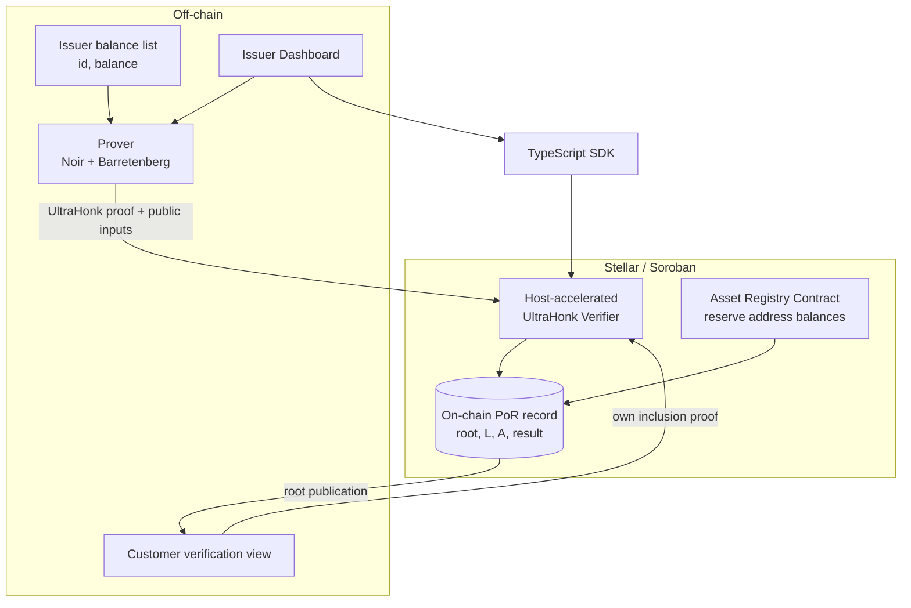
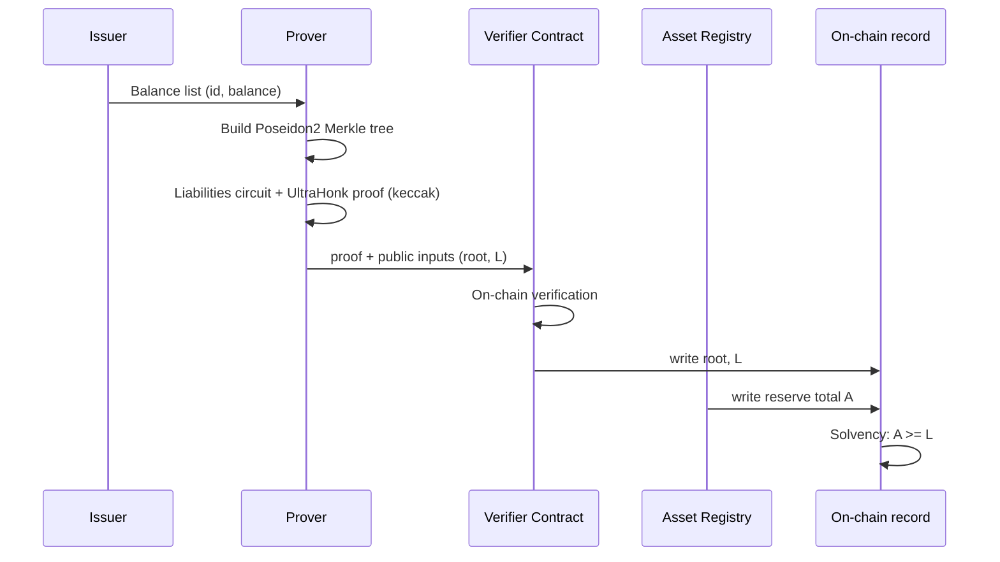

# ZK Proof of Reserves on Stellar: Architecture

A Noir and UltraHonk system on Stellar (Soroban). It lets an issuer prove that
its reserves cover the customer liabilities, without disclosure of the individual
customer balances.

**Stack:** Noir (circuit language), UltraHonk (proving, universal setup, no
ceremony for each circuit), Barretenberg (`bb`, prover), a host-accelerated
Soroban UltraHonk verifier built on the CAP-0080 BN254 host functions, Poseidon2
(BN254 Fr), a TypeScript SDK, and an issuer dashboard.

The source uses tagged leaves, fixed attestation identifiers, and version 2 customer packages.
Circuit changes require matching verification keys and verifier contracts.

---

## 1. Problem and goal

The largest and fastest-growing segment on Stellar is RWA and stablecoins.
Issuers in this segment face a tension. Regulation and trust demand reserve
transparency. Disclosure of the customer balance distribution exposes
commercially sensitive information. A traditional Merkle-tree Proof of Reserves
leaks balance information, because it carries the sums in the intermediate nodes.

Goal: the issuer proves the claim "my reserves cover my liabilities"
cryptographically, the individual data stays private, and every customer can
independently verify that the committed total includes their own balance.

---

## 2. Scope

### In scope (MVP)
- The Proof of Liabilities ZK core: Poseidon2 Merkle tree, sum conservation,
  non-negativity, inclusion.
- On-chain Proof of Assets: the balance sum, and the ownership of the reserve
  addresses on Stellar by the issuer.
- Solvency check: do the assets cover the liabilities.
- Off-chain prover (proof generation) and issuer dashboard.
- Customer-side inclusion verification view.
- TypeScript SDK (generate and verify wrappers).

### Out of scope (deliberate boundary)
- The real existence of the off-chain reserves (bank deposits, tokenized
  treasuries). This is not cryptographically verifiable and needs an auditor
  attestation or an oracle attestation. The MVP leaves only an attestation
  interface.
- The scale-up to millions of users. Recursive aggregation is implemented, and
  it folds the batch proofs into one on-chain verify. The orchestration for a
  customer base of that size is not in this scope.
- Cross-chain reserve proofs and the fiat off-ramp.

---

## 3. Verification design

The system uses a host-accelerated UltraHonk verifier.
The verifier calls the CAP-0080 BN254 host functions.
The inner batch circuit and aggregator produce one terminal proof.
The verifier completes the deferred recursive pairing on-chain.

The proof format depends on the pinned circuit toolchain and oracle hash.
A deployment must use the matching verifier and verification key.
Check transaction resources against the target network before deployment.

---

## 4. System architecture

```mermaid
graph TB
    subgraph OFF["Off-chain"]
        BAL[Issuer balance list<br/>id, balance]
        PROVER[Prover<br/>Noir + Barretenberg]
        DASH[Issuer Dashboard]
        UVIEW[Customer verification view]
    end

    subgraph CHAIN["Stellar / Soroban"]
        VERIFIER[Host-accelerated<br/>UltraHonk Verifier]
        REGISTRY[Asset Registry Contract<br/>reserve address balances]
        STATE[(On-chain PoR record<br/>root, L, A, result)]
    end

    SDK[TypeScript SDK]

    BAL --> PROVER
    PROVER -->|UltraHonk proof + public inputs| VERIFIER
    DASH --> PROVER
    DASH --> SDK
    SDK --> VERIFIER
    VERIFIER --> STATE
    REGISTRY --> STATE
    STATE -->|root publication| UVIEW
    UVIEW -->|own inclusion proof| VERIFIER
```

Components:

1. **Noir circuits.** They hold the cryptographic logic. The original design had
   two circuits, liabilities and inclusion. The implemented path is the recursive
   inner batch circuit plus the aggregator (`circuits/recursion`). See sections 6
   and 10.
2. **Off-chain prover.** It builds the Poseidon2 Merkle tree from the balance
   list, runs the Noir circuit, and produces an UltraHonk proof and a
   verification key with `bb`.
3. **Host-accelerated Soroban UltraHonk verifier.** It verifies the proof
   on-chain with the CAP-0080 BN254 host functions (MSM, pairing, Fr arithmetic).
   It is adapted from the `NethermindEth/rs-soroban-ultrahonk` host-accelerated
   verifier, which yugocabrio wrote. The deploy step sets the VK.
4. **Asset Registry contract.** It reads the balances of the reserve addresses of
   the issuer on Stellar and computes the total assets (A).
5. **Issuer dashboard and customer view.** A local process on a machine the
   issuer controls (`dashboard/`). It serves the loopback address only. The
   issuer names the path of the balance file, and the process proves and
   submits in its own process and shows the status. The customer verifies their
   own inclusion on the same interface. The browser is the display. Every page
   except the page of a run carries no script. The page of a run loads one
   script from this process, and that script follows the run. No
   project-operated service receives a raw balance, a salt, a path, a witness,
   or a key.
6. **TypeScript SDK.** A library that wraps the proof generation flow and the
   verification flow, for other teams to integrate.

---

## 5. Proving stack and rationale

UltraHonk uses the universal KZG SRS.
A circuit change does not require a separate setup ceremony.
The verifier uses the CAP-0080 BN254 host functions.
The project retains the indextree pure-Wasm implementation as a technical reference.

**Proof generation command (it determines the format and must stay fixed):**
`bb prove --scheme ultra_honk --oracle_hash keccak --output_format bytes_and_fields`
The on-chain transcript needs `oracle_hash keccak`. The prover must produce the
VK and the proof with this choice, and the build of the verifier must use the
same assumption.

---

## 6. Circuit design

The implemented path uses the recursive inner batch circuit and aggregator in `circuits/recursion`.
The verifier completes the deferred recursive pairing on-chain.
The inner batch circuit implements these checks from section 6.1:

- the Poseidon2 leaf;
- the `u64` range check;
- the `u128` sum;
- the Merkle membership check.

The inclusion circuit
of section 6.2 is roadmap work and does not exist yet. The subsections below
describe the circuit design. They do not claim that the single liabilities
circuit is the current implementation.

### 6.1 Liabilities circuit

It commits the total liability of the issuer without disclosure of the individual
balances.

- **Private input:** the customer identifiers, `u64` balances, and salts.
- **Public input:** the Merkle root, and the total liability `L`.
- **Constraints:**
  1. The circuit computes `commitment = Poseidon2(BALANCE_DOMAIN_TAG, balance, salt)`.
  2. It computes `leaf = Poseidon2(LEAF_DOMAIN_TAG, id, commitment)`.
  3. The Merkle tree that the circuit builds from the leaves agrees with the
     given `root`.
  4. The sum of all the balances equals the committed `L`: `sum(balance) == L`.
  5. Each balance is in range. This check is critical. Without a range check the
     issuer can inject a negative balance to lower the total falsely.

**Typed integer rule.** The
balances must be typed integers: `u64` for the value, and a `u128` accumulator
for the sum. A bare `Field` is not acceptable. A bare `Field` wraps mod p and is
not non-negative, so a negative balance or a wrapped balance passes silently. The
sum accumulator must be `u128`, to avoid an overflow when the circuit adds many
`u64` values.

### 6.2 Inclusion circuit

It lets a customer verify that the committed tree contains their own balance,
without a view of the data of any other customer.

- **Private input:** the `(id, balance)` pair of the customer, and the Merkle
  path.
- **Public input:** the Merkle root.
- **Constraint:** the leaf belongs to the given root.

The Merkle membership pattern from the reference is mature, and both circuits
reuse it directly. That pattern is a depth-folded Poseidon2 with a bit-constrained
path. The only item to fix is the leaf formula and the hash arity for the PoR
semantics: the commitment includes the balance and a salt.

### 6.3 Assets (on-chain, not ZK)

The Asset Registry contract reads the on-chain balances of the declared reserve
addresses of the issuer and computes the total `A`. The issuer proves the
ownership of those addresses by signature. This part needs no ZK. If the project
wants address privacy, a second phase can extend this part with ZK.

### 6.4 Solvency

A check that `A >= L`. If both values are public, an on-chain comparison is
enough. If the project wants privacy, it needs a range proof.

---

## 7. Data flow

This section shows the original single-proof flow. The production path proves the
customers in batches and folds them into one terminal proof with recursive
aggregation (see sections 6 and 10).

### Issuer flow

```mermaid
sequenceDiagram
    participant I as Issuer
    participant P as Prover
    participant V as Verifier Contract
    participant R as Asset Registry
    participant S as On-chain record

    I->>P: Balance list (id, balance)
    P->>P: Build Poseidon2 Merkle tree
    P->>P: Liabilities circuit + UltraHonk proof (keccak)
    P->>V: proof + public inputs (root, L)
    V->>V: On-chain verification
    V->>S: write root, L
    R->>S: write reserve total A
    S->>S: Solvency: A >= L
```

### Customer flow

1. The customer gets their own `(id, balance)` pair and Merkle path from the
   issuer.
2. The customer verifies the inclusion against the published root locally, or
   generates an inclusion proof.
3. The customer independently confirms that the committed total counts their
   balance.

---

## 8. Trust and security model

**Setup assumption.** The universal KZG SRS. There is no ceremony for each
circuit, and the project uses the existing universal ceremony. The trust
assumption is 1-of-N honest: the security holds if at least one of the many
contributors is honest. The project treats this as practically risk-free.

**What the system guarantees:**
- The committed total liability equals the sum of the real balances.
- No balance is negative.
- Every customer can verify their own inclusion.

**What the system does not guarantee:**
- The real existence of the off-chain reserves. This needs an attestation and is
  out of scope.
- That the issuer included all customers. Earlier inclusion permits a dispute against a later attestation.
  Nonresponse is a protocol outcome, not a cryptographic proof of omission.

The registry stores every accepted attestation under an asset-specific identifier.
The submission returns that identifier, and customer packages use it to select a fixed root.
History reads do not depend on the endpoint's event retention window.
The issuer retains redacted manifests that bind each identifier to its balance commitment.
The generator checks customer continuity and requires zero-balance rows for closed accounts.

Dispute evidence exposes the identifier, commitment, position, and path, without the balance or salt.
The target window is 518,400 ledgers, and the answer window is 51,840 ledgers.
A dispute requires a 10 XLM deposit.
A valid answer transfers the deposit to the issuer.
Nonresponse returns it to the disputer and permanently locks the optional bond.
The bond has no withdrawal path, and the protocol pays no bounty.

---

## 9. Throughput and design constraints

Network resource limits apply to each attestation transaction.
Reserve balance calls contribute to its cost.
The deployment procedure must check the target network's limits.

The design separates the shared attestation from individual customer checks:

- The issuer submits one root and one aggregate proof for each reporting period.
- Customers check inclusion locally against their selected attestation.
- The prover divides the customer set into batches and combines their proofs through recursive aggregation.

---

## 10. Out of scope / future work

- Off-chain reserve attestation (auditor or oracle). The MVP has the interface
  only.
- Cross-chain reserve proofs and the fiat off-ramp.
- ZK address privacy on the asset side.

### Deferred pairing optimization

The verifier completes the deferred recursive pairing in a separate `pairing_check` call.
A future implementation can combine it with the Shplemini pairing.
That change requires independent review and the same soundness gate.

---

## 11. Risks

- **Unaudited verifier (the highest risk).** No party audited the
  host-accelerated verifier. A verifier bug means that the verifier silently
  accepts a forged proof, which makes the funds look backed when they are not.
  The production verifier now completes the deferred recursive pairing on-chain.
  An independent audit must cover BOTH the naive form that ships now AND the
  batched form that comes later. The audit must cover
  `complete_pairing_point_accumulator`, the decode from the 68-bit limbs to G1
  (`point_from` and `coord_be`), and the `pairing_check` convention, against the
  bb 0.87.0 proof format. The soundness gate (honest ACCEPT, forged REJECT,
  deflated REJECT) is necessary, but it is NOT a substitute for an audit. The
  launch needs an audit and a positive test and a negative test for each circuit.
- **Version fragility.** The proof format depends on `bb 0.87.0`, on
  `oracle_hash keccak`, and on Noir `1.0.0-beta.9`. If any one of these changes,
  the VK, the proof, and the verifier must change together, and the project must
  test the compatibility again. All of them are pinned and locked.
- **Protocol-version drift.** The verifier depends on the CAP-0080 BN254 host functions and a stable proof format.
  A protocol change requires a new soundness check.
  Confirm that the target network supports the required host functions before deployment.
- **Typed integer and overflow discipline.** The balances are typed integers, not
  `Field` values. The sum accumulator is `u128`. A missing range constraint is a
  hidden vulnerability.
- **Throughput.** Network resource limits bound the number of attestations in each ledger.
  Customer inclusion checks run locally and require no transaction.
- **Prover cost.** In a large liabilities circuit the bottleneck is the proof
  generation, not the verification. Evaluate recursive aggregation, or an
  architecture of per-user inclusion plus a separate proof of the sum.

---

## 12. Pinned version matrix

The repository pins these versions in [`scripts/versions.env`](../scripts/versions.env) and the dependency manifests.

| Component | Pinned version | Note |
|---|---|---|
| Nargo (Noir) | 1.0.0-beta.9 | |
| Barretenberg (`bb`) | 0.87.0 | linux amd64 binary |
| Noir Poseidon library | noir-lang/poseidon v0.2.0 | `Poseidon2` |
| In-circuit recursive verify (`bb_proof_verification`) | v0.87.0 | format-determining: 456-field proof / 112-field vk; read at the bb tag, used by the aggregator circuit |
| Rust | 1.96.0 | targets `wasm32v1-none`, `wasm32-unknown-unknown` |
| Stellar CLI | 27.0.0 | command-line client |
| Quickstart image | stellar/quickstart:nightly | localnet protocol selected with `--protocol-version 27` |
| soroban-sdk (host-accelerated verifier) | 26.0.1 | workspace dependency |
| soroban-poseidon | 26.0.0 | host-side Poseidon2 used by the witness generator |
| Host-accelerated verifier | vendored in-repo (CAP-0080) | `contracts/vendor/ultrahonk-soroban-verifier` with the completed-pairing patch; provenance in its `VENDOR.md`; no longer an external git rev |
| Proof scheme | ultra_honk, oracle_hash keccak | format-determining |

---

## 13. Technical references

- `NethermindEth/rs-soroban-ultrahonk` (written by yugocabrio): the
  host-accelerated UltraHonk Soroban verifier (CAP-0080 BN254), the base of this
  project.
- indextree/ultrahonk_soroban_contract: the pure-Wasm technical reference.
- Yardstick / CAP-0080: the ZK BN254 host functions.
- X-Ray / CAP-0074, CAP-0075: the BN254 and Poseidon primitives (Protocol 25).
- The Stellar ZK and Privacy docs, the Noir docs, and the Barretenberg docs.
