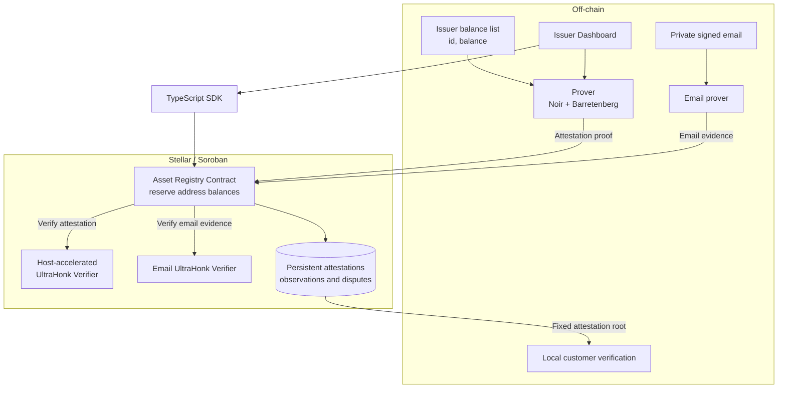
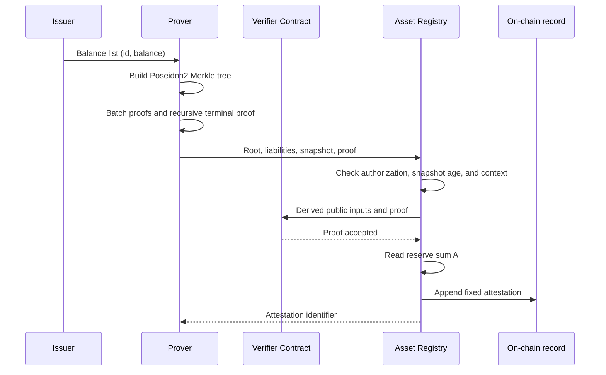

# ZK Proof of Reserves on Stellar: Architecture

A Noir and UltraHonk system on Stellar (Soroban). It proves the sum of committed customer balances without disclosure of individual balances.
The registry records that total and the reserve balances. Readers compare those amounts to assess coverage.

**Stack:** Noir (circuit language), UltraHonk (proving, universal setup, no
ceremony for each circuit), Barretenberg (`bb`, prover), a host-accelerated
Soroban UltraHonk verifier built on the CAP-0080 BN254 host functions, Poseidon2
(BN254 Fr), a TypeScript SDK, and an issuer dashboard.

The source uses tagged leaves, fixed attestation identifiers, and version 2 or 3 customer packages.
Circuit changes require matching verification keys and verifier contracts.

---

## 1. Problem and goal

Issuers need reserve transparency without disclosure of individual customer balances.
A tree that exposes intermediate balance sums can reveal information about other customers.
This system uses salted commitments and a proof of the total.

Goal: the issuer proves the claim "my reserves cover my liabilities"
cryptographically, the individual data stays private, and every customer can
independently verify that the committed total includes their own balance.

---

## 2. Scope

### In scope (MVP)
- The Proof of Liabilities ZK core: Poseidon2 Merkle tree, sum conservation,
  non-negativity, inclusion.
- On-chain Proof of Assets: the balance sum, and the ownership of the reserve
  addresses on Stellar by the issuer.
- A dashboard comparison of the attested reserves and committed liabilities.
- Off-chain prover (proof generation) and issuer dashboard.
- Customer-side inclusion verification view.
- TypeScript SDK (generate and verify wrappers).
- Durable attestation and reserve observation histories.
- Fixed-target disputes from earlier inclusion or authorized DKIM email evidence.

### Out of scope (deliberate boundary)
- The real existence of the off-chain reserves (bank deposits, tokenized
  treasuries). This is not cryptographically verifiable and needs an auditor
  attestation or an oracle attestation. The MVP leaves only an attestation
  interface.
- The scale-up to millions of users. Recursive aggregation is implemented, and
  it folds the batch proofs into one on-chain verify. The orchestration for a
  customer base of that size is not in this scope.
- Cross-chain reserve proofs and the fiat off-ramp.

---

## 3. Verification design

The system uses a host-accelerated UltraHonk verifier.
The verifier calls the CAP-0080 BN254 host functions.
The inner batch circuit and aggregator produce one terminal proof.
The verifier completes the deferred recursive pairing on-chain.

The proof format depends on the pinned circuit toolchain and oracle hash.
A deployment must use the matching verifier and verification key.
Check transaction resources against the target network before deployment.

---

## 4. System architecture

```mermaid
graph TB
    subgraph OFF["Off-chain"]
        BAL[Issuer balance list<br/>id, balance]
        PROVER[Prover<br/>Noir + Barretenberg]
        EMAIL[Private signed email]
        EPROVER[Email prover]
        DASH[Issuer Dashboard]
        UVIEW[Local customer verification]
    end

    subgraph CHAIN["Stellar / Soroban"]
        VERIFIER[Host-accelerated<br/>UltraHonk Verifier]
        EVERIFIER[Email UltraHonk Verifier]
        REGISTRY[Asset Registry Contract<br/>reserve address balances]
        STATE[(Persistent attestations<br/>observations and disputes)]
    end

    SDK[TypeScript SDK]

    BAL --> PROVER
    PROVER -->|Attestation proof| REGISTRY
    EMAIL --> EPROVER
    EPROVER -->|Email evidence| REGISTRY
    DASH --> PROVER
    DASH --> SDK
    SDK --> REGISTRY
    REGISTRY -->|Verify attestation| VERIFIER
    REGISTRY -->|Verify email evidence| EVERIFIER
    REGISTRY --> STATE
    STATE -->|Fixed attestation root| UVIEW
```

Components:

1. **Noir circuits.** The recursive inner circuit and aggregator prove the committed liabilities (`circuits/recursion`).
   The separate email circuit proves a signed identifier under an authorized DKIM key (`circuits/email`).
2. **Off-chain prover.** It builds the Poseidon2 Merkle tree from the balance
   list, runs the Noir circuit, and produces an UltraHonk proof and a
   verification key with `bb`.
3. **Host-accelerated Soroban UltraHonk verifier.** It verifies the proof
   on-chain with the CAP-0080 BN254 host functions (MSM, pairing, Fr arithmetic).
   It is adapted from the `NethermindEth/rs-soroban-ultrahonk` host-accelerated
   verifier, which yugocabrio wrote. The deploy step sets the VK.
4. **Asset Registry contract.** It reads the balances of the reserve addresses of
   the issuer on Stellar and computes the total assets (A).
   It verifies proofs through the configured verifiers and stores attestations, observations, key registrations, and disputes.
   It holds dispute deposits and bonds, but takes no custody of the registered reserves.
5. **Issuer dashboard and customer view.** A local process on a machine the
   issuer controls (`dashboard/`). It serves the loopback address only. The
   issuer names the path of the balance file, and the process proves and
   submits in its own process and shows the status. The customer verifies their
   own inclusion on the same interface. The browser is the display. Every page
   except the page of a run carries no script. The page of a run loads one
   script from this process, and that script follows the run. No
   project-operated service receives a raw balance, a salt, a path, a witness,
   or a key.
   The dispute page reads a fixed dispute and answers from a retained redacted tree.
   A separate local answer command uses the same issuer operation.
6. **TypeScript SDK.** A library that wraps the proof generation flow and the
   verification flow, for other teams to integrate.

---

## 5. Proving stack and rationale

UltraHonk uses the universal KZG SRS.
A circuit change does not require a separate setup ceremony.
The verifier uses the CAP-0080 BN254 host functions.
The project retains the indextree pure-Wasm implementation as a technical reference.

**Proof generation command (it determines the format and must stay fixed):**
`bb prove --scheme ultra_honk --oracle_hash keccak --output_format bytes_and_fields`
The on-chain transcript needs `oracle_hash keccak`. The prover must produce the
VK and the proof with this choice, and the build of the verifier must use the
same assumption.

---

## 6. Circuit design

The implemented path uses the recursive inner batch circuit and aggregator in `circuits/recursion`.
The verifier completes the deferred recursive pairing on-chain.
The inner batch circuit implements these checks from section 6.1:

- the Poseidon2 leaf;
- the `u64` range check;
- the `u128` sum;
- the Merkle subtree root check.

Customer inclusion checks use the local procedure in section 6.2.
They require no separate inclusion circuit or on-chain proof.
The email circuit authenticates a different claim: the authorized signer signed the identifier in the exact Subject.

### 6.1 Liabilities circuit

It commits the total liability of the issuer without disclosure of the individual
balances.

- **Private input:** the customer identifiers, `u64` balances, and salts.
- **Public input:** the Merkle root, and the total liability `L`.
- **Constraints:**
  1. The circuit computes `commitment = Poseidon2(BALANCE_DOMAIN_TAG, balance, salt)`.
  2. It computes `leaf = Poseidon2(LEAF_DOMAIN_TAG, id, commitment)`.
  3. The Merkle tree that the circuit builds from the leaves agrees with the
     given `root`.
  4. The sum of all the balances equals the committed `L`: `sum(balance) == L`.
  5. Each balance is in range. This check is critical. Without a range check the
     issuer can inject a negative balance to lower the total falsely.

**Typed integer rule.** The
balances must be typed integers: `u64` for the value, and a `u128` accumulator
for the sum. A bare `Field` is not acceptable. A bare `Field` wraps mod p and is
not non-negative, so a negative balance or a wrapped balance passes silently. The
sum accumulator must be `u128`, to avoid an overflow when the circuit adds many
`u64` values.

### 6.2 Local inclusion verification

The customer retains a private package with their identifier, balance, salt, commitment, and Merkle path.
The local verifier recomputes the commitment and tagged leaf, then checks the path against the fixed attestation root.
A version 3 package also permits a local identifier check from the customer's own email and persistent code.
The package and identity file remain private.

A public dispute uses only the identifier, commitment, position, and sibling hashes.
The registry checks that path directly. It does not need a separate inclusion proof circuit.

### 6.3 Assets (on-chain, not ZK)

The Asset Registry contract reads the on-chain balances of the declared reserve
addresses of the issuer and computes the total `A`. Each reserve address authorizes its registration.
That authorization does not prove exclusive ownership or prevent later transfers. This part needs no ZK. If the project
wants address privacy, a second phase can extend this part with ZK.

### 6.4 Solvency

The dashboard compares `A >= L` using the two amounts in one attestation.
The registry records an attestation even when its reserves fall below its committed liabilities.
Acceptance proves the commitment and records the reserve balances. It does not state that coverage passed.

---

## 7. Data flow

The production path proves the customers in batches and folds them into one terminal proof with recursive aggregation.
The registry derives the context and public inputs, reads the reserves, and verifies the proof before it appends an attestation.

### Issuer flow

```mermaid
sequenceDiagram
    participant I as Issuer
    participant P as Prover
    participant V as Verifier Contract
    participant R as Asset Registry
    participant S as On-chain record

    I->>P: Balance list (id, balance)
    P->>P: Build Poseidon2 Merkle tree
    P->>P: Batch proofs and recursive terminal proof
    P->>R: Root, liabilities, snapshot, proof
    R->>R: Check authorization, snapshot age, and context
    R->>V: Derived public inputs and proof
    V-->>R: Proof accepted
    R->>R: Read reserve sum A
    R->>S: Append fixed attestation
    R-->>P: Attestation identifier
```

### Customer flow

1. The customer receives their private package from the issuer.
2. The customer compares its balance with their own account records.
3. The customer verifies its inclusion against the fixed attestation root locally.
4. For version 3, the customer checks the identifier from their own email and retained code.

---

## 8. Trust and security model

**Setup assumption.** The universal KZG SRS. There is no ceremony for each
circuit, and the project uses the existing universal ceremony. The trust
assumption is 1-of-N honest: the security holds if at least one of the many
contributors is honest. This remains a cryptographic trust assumption.

**What the system guarantees:**
- The committed total liability equals the sum of the submitted, range-checked balances.
- No balance is negative.
- A customer with a package can verify its inclusion against the fixed attestation.

**What the system does not guarantee:**
- The real existence of the off-chain reserves. This needs an attestation and is
  out of scope.
- That the issuer included all customers. Earlier inclusion or a qualifying signed email permits a dispute.
  A customer who was never included and never received a qualifying signed identifier email has neither evidence path.
- That an included balance equals the real debt. An issuer can answer an omission dispute for an identifier with an incorrect balance.
- Honest participation. A customer can collude with the issuer, accept an understated balance, or decline to challenge an omission.
- Continuous reserves. Each attestation and observation samples balances once; a decrease between samples can remain undetected.

The registry stores every accepted attestation under an asset-specific identifier.
The submission returns that identifier, and customer packages use it to select a fixed root.
History reads do not depend on the endpoint's event retention window.
Persistent records require storage lifetime management and restoration after archival.
An unavailable historical read must not appear as an empty record.
The issuer retains redacted manifests that bind each identifier to its balance commitment.
The generator checks customer continuity and requires zero-balance rows for closed accounts.

Inclusion evidence exposes the identifier, commitment, position, and path, without the balance or salt.
Email evidence exposes an identifier, registration ID, and proof. Its signed header remains private.
The issuer authorizes the DKIM key, domain, and exact signed From field for the asset.
The email itself does not name an asset or prove a balance, body content, receipt time, or date relative to the target.
Old key registrations remain accepted, including after rotation or key compromise.
The target window is 518,400 ledgers, and the answer window is 51,840 ledgers.
The target age uses its execution ledger. The fixed target cannot change after opening.
A dispute requires a 10 XLM deposit.
A valid answer transfers the deposit to the issuer.
Nonresponse returns it to the disputer and permanently locks the optional bond.
Anyone can resolve after the deadline. Nonresponse is a permanent protocol outcome, not a cryptographic proof of omission.
The bond has no withdrawal path, and the protocol pays no bounty.
The local answer driver validates the complete retained tree against the fixed target.
It sends only a redacted inclusion path and rereads the dispute after settlement.

Anyone can submit a reserve observation transaction without issuer authorization.
The registry reads its registered reserve addresses and compares their sum with the current attestation's reserve sum.
It stores the observation and retains the first low result after recovery, later attestations, and reserve changes.
Without a current attestation, an observation has no comparison baseline.
The dashboard's live simulation does not persist an observation.

---

## 9. Throughput and design constraints

Network resource limits apply to each attestation transaction.
Reserve balance calls contribute to its cost.
The deployment procedure must check the target network's limits.

The design separates the shared attestation from individual customer checks:

- The issuer submits one root and one aggregate proof for each reporting period.
- Customers check inclusion locally against their selected attestation.
- The prover divides the customer set into batches and combines their proofs through recursive aggregation.

---

## 10. Out of scope / future work

- Off-chain reserve attestation (auditor or oracle). The MVP has the interface
  only.
- Cross-chain reserve proofs and the fiat off-ramp.
- ZK address privacy on the asset side.

### Deferred pairing optimization

The verifier completes the deferred recursive pairing in a separate `pairing_check` call.
A future implementation can combine it with the Shplemini pairing.
That change requires independent review and the same soundness gate.

---

## 11. Risks

- **Unaudited verifier (the highest risk).** No party audited the
  host-accelerated verifier. A verifier bug means that the verifier silently
  accepts a forged proof, which makes the funds look backed when they are not.
  The production verifier now completes the deferred recursive pairing on-chain.
  An independent audit must cover the current implementation and any future batched form.
  The audit must cover
  `complete_pairing_point_accumulator`, the decode from the 68-bit limbs to G1
  (`point_from` and `coord_be`), and the `pairing_check` convention, against the
  bb 0.87.0 proof format. The soundness gate (honest ACCEPT, forged REJECT,
  deflated REJECT) is necessary, but it is NOT a substitute for an audit. The
  launch needs an audit and a positive test and a negative test for each circuit.
- **Version fragility.** The proof format depends on `bb 0.87.0`, on
  `oracle_hash keccak`, and on the circuit's pinned Noir compiler. The core uses `1.0.0-beta.9`; email uses `1.0.0-beta.5`.
  If any one of these changes,
  the VK, the proof, and the verifier must change together, and the project must
  test the compatibility again. All of them are pinned and locked.
- **Protocol-version drift.** The verifier depends on the CAP-0080 BN254 host functions and a stable proof format.
  A protocol change requires a new soundness check.
  Confirm that the target network supports the required host functions before deployment.
- **Typed integer and overflow discipline.** The balances are typed integers, not
  `Field` values. The sum accumulator is `u128`. A missing range constraint is a
  hidden vulnerability.
- **Throughput.** Network resource limits bound the number of attestations in each ledger.
  Customer inclusion checks run locally and require no transaction.
- **Prover cost.** The production path uses recursive aggregation.
  Measure proof time and memory for the selected capacity and hardware before deployment.

---

## 12. Pinned version matrix

The repository pins these versions in [`scripts/versions.env`](../scripts/versions.env) and the dependency manifests.

| Component | Pinned version | Note |
|---|---|---|
| Nargo (Noir), core | 1.0.0-beta.9 | recursive liabilities circuits |
| Nargo (Noir), email | 1.0.0-beta.5 | separate compiler; paired with bb 0.87.0 |
| Barretenberg (`bb`) | 0.87.0 | linux amd64 binary |
| Noir Poseidon library | noir-lang/poseidon v0.2.0 | `Poseidon2` |
| In-circuit recursive verify (`bb_proof_verification`) | v0.87.0 | format-determining: 456-field proof / 112-field vk; read at the bb tag, used by the aggregator circuit |
| Rust | 1.96.0 | targets `wasm32v1-none`, `wasm32-unknown-unknown` |
| Stellar CLI | 27.0.0 | command-line client |
| Quickstart image | stellar/quickstart:nightly | localnet protocol selected with `--protocol-version 27` |
| soroban-sdk (host-accelerated verifier) | 26.0.1 | workspace dependency |
| soroban-poseidon | 26.0.0 | host-side Poseidon2 used by the witness generator |
| Host-accelerated verifier | vendored in-repo (CAP-0080) | `contracts/vendor/ultrahonk-soroban-verifier` with the completed-pairing patch; provenance in its `VENDOR.md`; no longer an external git rev |
| Proof scheme | ultra_honk, oracle_hash keccak | format-determining |

---

## 13. Technical references

- `NethermindEth/rs-soroban-ultrahonk` (written by yugocabrio): the
  host-accelerated UltraHonk Soroban verifier (CAP-0080 BN254), the base of this
  project.
- indextree/ultrahonk_soroban_contract: the pure-Wasm technical reference.
- Yardstick / CAP-0080: the ZK BN254 host functions.
- X-Ray / CAP-0074, CAP-0075: the BN254 and Poseidon primitives (Protocol 25).
- The Stellar ZK and Privacy docs, the Noir docs, and the Barretenberg docs.
